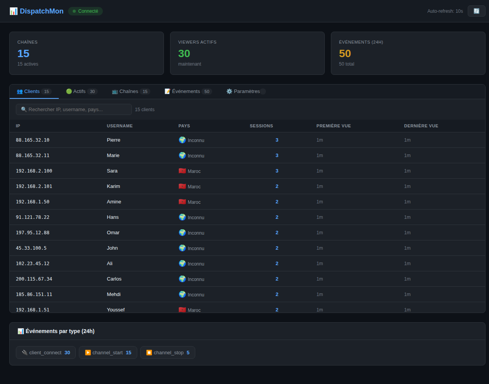
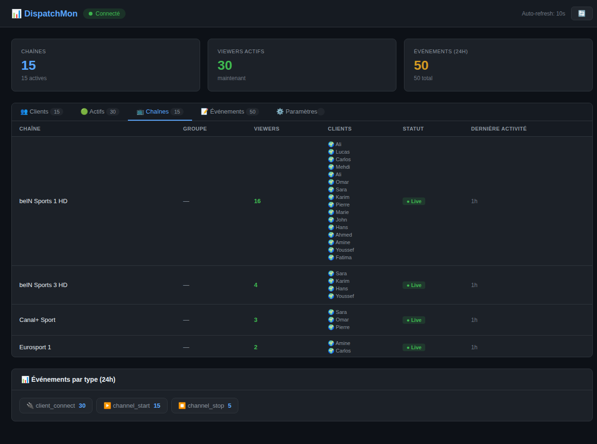
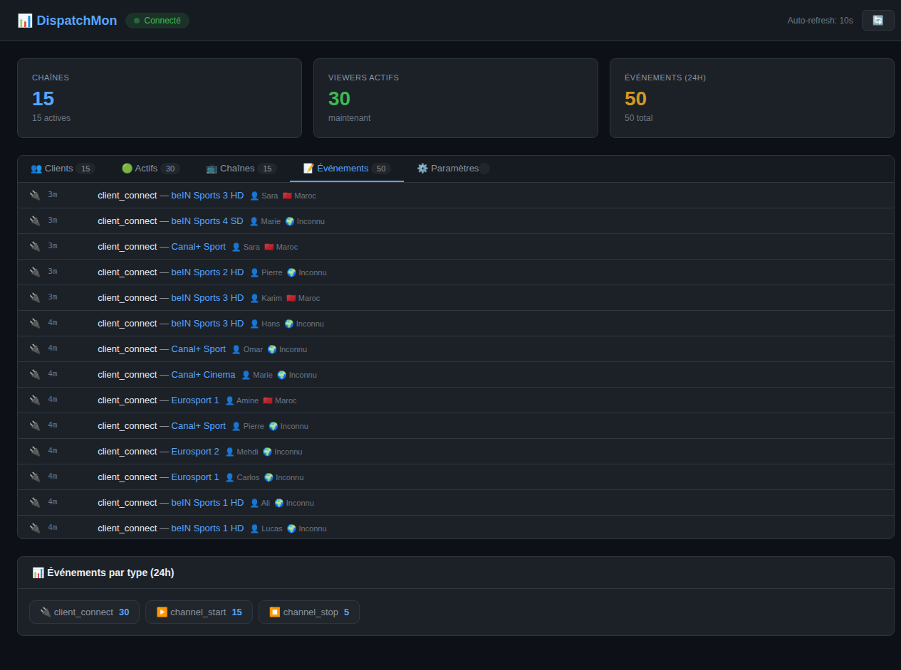
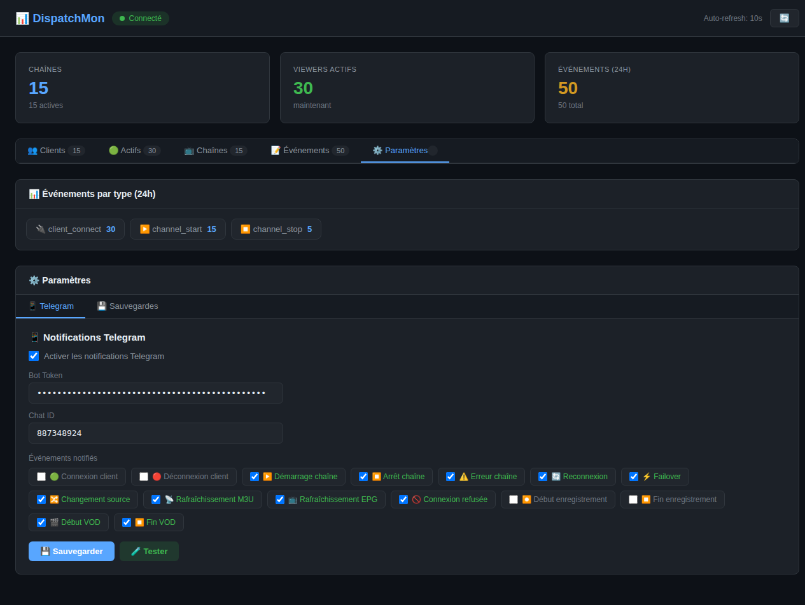
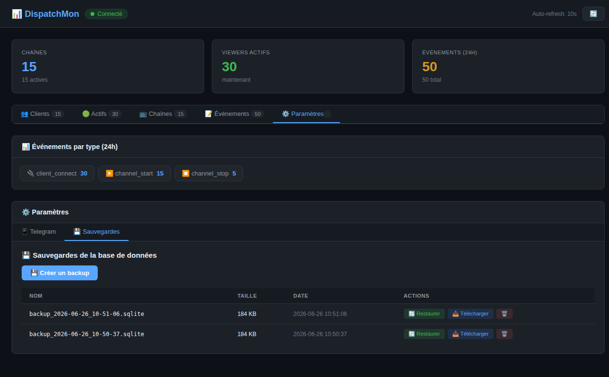

# 📊 DispatchMon

Dashboard web temps réel pour **Dispatcharr** — monitorer les chaînes, clients, événements et notifications Telegram.

[](https://github.com/mahadouch/DispatchMon/releases)
[](LICENSE)

---

## 📋 Table des matières

- [Fonctionnalités](#-fonctionnalités)
- [Screenshots](#-screenshots)
- [Installation](#-installation)
- [Configuration Dispatcharr](#-configuration-dispatcharr)
- [Notifications Telegram](#-notifications-telegram)
- [Sauvegardes](#-sauvegardes)
- [API Reference](#-api-reference)
- [Scripts](#-scripts)
- [Structure du projet](#-structure-du-projet)

---

## ✨ Fonctionnalités

| Module | Description |
|--------|-------------|
| **👥 Clients** | Liste des clients connus (IP, username, pays, sessions) avec recherche |
| **🟢 Actifs** | Clients en temps réel connectés aux chaînes |
| **📺 Chaînes** | État des chaînes (live/off), viewers, liste des clients par chaîne |
| **📝 Événements** | Historique détaillé avec client, pays et type |
| **📱 Telegram** | Notifications push configurables (15 types d'événements) |
| **💾 Sauvegardes** | Backup/restore de la base de données |
| **🌐 Géolocalisation** | Détection automatique du pays via ip-api.com |
| **🚀 Mises à jour** | Notification automatique lors de nouvelles releases GitHub |

### Dashboard

- **Stats globales** : chaînes, viewers actifs, événements 24h
- **Auto-refresh** toutes les 10 secondes
- **Dark theme** avec design moderne
- **Version dynamique** avec notification de mise à jour

---

## 📸 Screenshots

| Dashboard | Chaînes | Événements |
|-----------|---------|------------|
|  |  |  |

| Paramètres Telegram | Sauvegardes | À propos |
|---------------------|-------------|----------|
|  |  | |

---

## 🚀 Installation

### Installation rapide (recommandée)

```bash
curl -fsSL https://raw.githubusercontent.com/mahadouch/DispatchMon/master/install.sh | bash
```

Le script automatise :
- Installation de Docker + Docker Compose (si nécessaire)
- Clonage du repo
- Build des images Docker
- Démarrage des conteneurs
- Exécution des migrations
- Création du service systemd (démarrage auto au boot)
- Configuration Telegram (via .env)

### Mise à jour

```bash
cd ~/DispatchMon && git pull && sudo systemctl restart dispatchmon
```

### Commandes du service

```bash
sudo systemctl status dispatchmon      # Statut
sudo systemctl restart dispatchmon     # Redémarrer
sudo systemctl stop dispatchmon        # Arrêter
sudo journalctl -u dispatchmon -f      # Logs
```

### Installation manuelle

```bash
git clone https://github.com/mahadouch/DispatchMon.git
cd DispatchMon
docker compose up -d --build
```

### Services

| Service | URL | Description |
|---------|-----|-------------|
| **Frontend** | `http://localhost:3000` | Dashboard web |
| **Backend** | `http://localhost:8000` | API REST |

---

## ⚙️ Configuration Dispatcharr

Dans votre serveur Dispatcharr, configurez l'intégration webhook :

1. Allez dans **Settings** → **Integrations** → **Connect**
2. Créez une nouvelle intégration **Webhook**
3. Entrez l'URL : `http://<VOTRE_IP>:8000/api/webhook/dispatcharr`
4. Ajoutez les subscriptions pour chaque événement :
   - `channel_start` / `channel_stop`
   - `client_connect` / `client_disconnect`
   - `channel_error` / `channel_reconnect` / `channel_failover`
   - `stream_switch` / `m3u_refresh` / `epg_refresh`
   - `login_failed` / `recording_start` / `recording_end`
   - `vod_start` / `vod_stop`

---

## 📱 Notifications Telegram

### Configuration

1. Créez un bot via **@BotFather** sur Telegram
2. Récupérez le **Bot Token**
3. Envoyez un message au bot puis récupérez le **Chat ID** via :
   ```
   https://api.telegram.org/bot<BOT_TOKEN>/getUpdates
   ```
4. Configurez dans le dashboard → ⚙️ Paramètres → 📱 Telegram

### Via fichier .env (recommandé)

```bash
# Créer le fichier .env
cat > ~/DispatchMon/.env << EOF
TELEGRAM_BOT_TOKEN=ton_token
TELEGRAM_CHAT_ID=ton_chat_id
TELEGRAM_ENABLED=1
EOF
```

### Événements notifiés

| Événement | Description | Exemple |
|-----------|-------------|---------|
| `client_connect` | Nouveau client connecté | 🟢 Nouveau client 👤 user 🇲🇦 Maroc |
| `client_disconnect` | Client déconnecté | 🔴 Déconnexion |
| `channel_start` | Chaîne démarrée | ▶️ Chaîne démarrée 📺 beIN Sports 1 |
| `channel_stop` | Chaîne arrêtée | ⏹️ Chaîne arrêtée ⏱️ 7200s |
| `channel_error` | Erreur de stream | ⚠️ Erreur 📺 channel |
| `channel_reconnect` | Tentative reconnexion | 🔄 Reconnexion tentative 2/5 |
| `channel_failover` | Basculement source | ⚡ Failover |
| `stream_switch` | Changement de source | 🔀 Changement source |
| `m3u_refresh` | Rafraîchissement M3U | 📡 +12 créés, -2 supprimés |
| `epg_refresh` | Rafraîchissement EPG | 📺 850 programmes |
| `login_failed` | Connexion refusée | 🚫 Connexion refusée |
| `recording_start` | Début enregistrement | ⏺️ Enregistrement démarré |
| `recording_end` | Fin enregistrement | ⏹️ Enregistrement terminé |
| `vod_start` | Début VOD | 🎬 VOD démarré |
| `vod_stop` | Fin VOD | ⏹️ VOD terminé |

### Exemple de notification

```
▶️ Chaîne démarrée
📺 beIN Sports 1 HD
🏷️ Stream: beinsports1-hd
📡 Provider: Yassine
⚙️ Profil: VLC
🔗 http://source.example.com/live/stream1
🕐 26/06/2026 10:43
```

---

## 💾 Sauvegardes

### Via le dashboard

1. Allez dans ⚙️ Paramètres → 💾 Sauvegardes
2. Cliquez sur **💾 Créer un backup**
3. Le backup est sauvegardé dans `storage/app/backups/`

### Actions disponibles

- **🔄 Restaurer** : Écrase la base actuelle avec le backup
- **📥 Télécharger** : Télécharge le fichier `.sqlite`
- **🗑️ Supprimer** : Supprime un backup

### Via API

```bash
# Créer un backup
curl -X POST http://localhost:8000/api/backups

# Lister les backups
curl http://localhost:8000/api/backups

# Restaurer
curl -X POST http://localhost:8000/api/backups/backup_2026-01-01_12-00-00/restore

# Télécharger
curl -O http://localhost:8000/api/backups/backup_2026-01-01_12-00-00/download

# Supprimer
curl -X DELETE http://localhost:8000/api/backups/backup_2026-01-01_12-00-00
```

---

## 📡 API Reference

### Webhook

```
POST /api/webhook/dispatcharr
```

Reçoit les événements de Dispatcharr (pas d'authentification).

### Stats

| Méthode | Endpoint | Description |
|---------|----------|-------------|
| `GET` | `/api/stats/summary` | Résumé global |
| `GET` | `/api/stats/channels` | Chaînes avec clients actifs |
| `GET` | `/api/stats/events` | 200 derniers événements |
| `GET` | `/api/stats/events/by-type` | Compteur par type (24h) |
| `GET` | `/api/stats/clients` | Clients actifs |
| `GET` | `/api/stats/timeline` | Événements par heure |
| `GET` | `/api/stats/m3u` | Stats M3U |
| `DELETE` | `/api/stats/events` | Purger > 30 jours |

### Clients

| Méthode | Endpoint | Description |
|---------|----------|-------------|
| `GET` | `/api/clients` | Tous les clients connus |
| `GET` | `/api/clients/active` | Clients connectés |
| `GET` | `/api/clients/stats` | Statistiques |

### Settings

| Méthode | Endpoint | Description |
|---------|----------|-------------|
| `GET` | `/api/settings` | Récupérer les settings |
| `PUT` | `/api/settings` | Mettre à jour |
| `POST` | `/api/settings/telegram/test` | Tester Telegram |

### Backups

| Méthode | Endpoint | Description |
|---------|----------|-------------|
| `GET` | `/api/backups` | Lister |
| `POST` | `/api/backups` | Créer |
| `POST` | `/api/backups/{name}/restore` | Restaurer |
| `GET` | `/api/backups/{name}/download` | Télécharger |
| `DELETE` | `/api/backups/{name}` | Supprimer |

### Version

| Méthode | Endpoint | Description |
|---------|----------|-------------|
| `GET` | `/api/version` | Version actuelle |
| `GET` | `/api/version/check` | Vérifier les mises à jour |

---

## 🛠️ Technologies

| Composant | Technologie | Version |
|-----------|-------------|---------|
| **Backend** | Laravel (PHP) | 11.x |
| **Frontend** | React + Vite | 19.x / 6.x |
| **Base de données** | SQLite | — |
| **Conteneurs** | Docker | — |
| **Notifications** | Telegram Bot API | — |
| **Géolocalisation** | ip-api.com | — |
| **Gestion versions** | GitHub Releases | — |

---

## 📁 Structure du projet

```
DispatchMon/
├── docker-compose.yml          # Orchestration Docker
├── Dockerfile.backend          # Image backend Laravel
├── Dockerfile.frontend         # Image frontend React
├── VERSION                     # Numéro de version
├── install.sh                  # Script d'installation
├── .env.example                # Template de configuration
│
├── backend/
│   ├── app/
│   │   ├── Http/Controllers/
│   │   │   ├── WebhookController.php    # Webhooks Dispatcharr
│   │   │   ├── StatsController.php      # API statistiques
│   │   │   ├── ClientController.php     # Gestion clients
│   │   │   ├── SettingsController.php   # Paramètres
│   │   │   ├── BackupController.php     # Sauvegardes
│   │   │   └── VersionController.php    # Version + updates
│   │   ├── Models/
│   │   │   ├── DispatcharrEvent.php
│   │   │   ├── Channel.php
│   │   │   ├── ActiveClient.php
│   │   │   ├── KnownClient.php
│   │   │   └── Setting.php
│   │   └── Services/
│   │       └── TelegramService.php
│   ├── bootstrap/app.php
│   ├── database/migrations/
│   └── routes/api.php
│
├── frontend/
│   ├── src/
│   │   ├── App.jsx             # Dashboard complet
│   │   ├── index.css           # Dark theme
│   │   └── main.jsx
│   └── vite.config.js
│
└── screenshots/                # Captures d'écran
```

---

## 📝 License

MIT

---

## 👤 Auteur

**mahadouch** — [GitHub](https://github.com/mahadouch)
