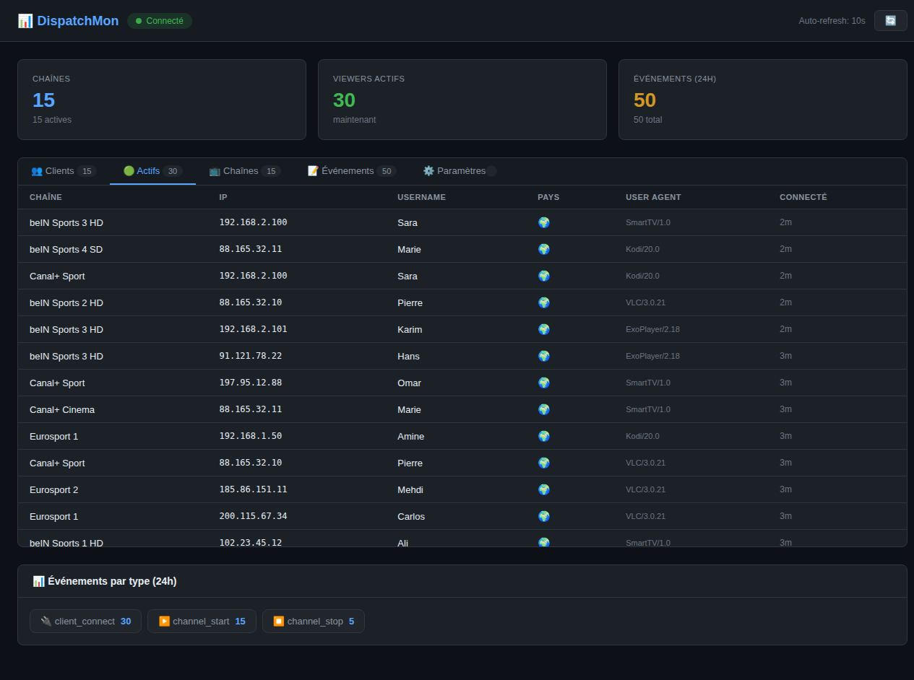

# 📊 DispatchMon

Dashboard web temps réel pour **Dispatcharr** — monitorer les chaînes, clients, événements et notifications Telegram.

---

## 📋 Table des matières

- [Fonctionnalités](#-fonctionnalités)
- [Architecture](#-architecture)
- [Technologies](#-technologies)
- [Prérequis](#-prérequis)
- [Installation](#-installation)
- [Configuration Dispatcharr](#-configuration-dispatcharr)
- [Notifications Telegram](#-notifications-telegram)
- [API Reference](#-api-reference)
- [Structure du projet](#-structure-du-projet)
- [Screenshots](#-screenshots)

---

## ✨ Fonctionnalités

| Module | Description |
|--------|-------------|
| **👥 Clients** | Liste des clients connus (IP, username, pays, sessions) avec recherche |
| **🟢 Actifs** | Clients en temps réel connectés aux chaînes |
| **📺 Chaînes** | État des chaînes (live/off), nombre de viewers |
| **📝 Événements** | Historique des événements avec client, pays et type |
| **⚙️ Paramètres** | Configuration des notifications Telegram |
| **📱 Telegram** | Notifications push pour connexions, déconnexions, erreurs |

### Dashboard

- **Stats globales** : chaînes, viewers actifs, événements 24h
- **Auto-refresh** toutes les 10 secondes
- **Dark theme** avec design moderne
- **Timeline** des événements par heure (24h)

---

## 🏗️ Architecture

```
┌─────────────────┐     ┌──────────────────┐
│  Dispatcharr     │────▶│  Webhook POST     │
│  (IPTV Server)   │     │  /api/webhook/    │
└─────────────────┘     └────────┬─────────┘
                                 │
                    ┌────────────▼────────────┐
                    │   Backend (Laravel)      │
                    │   - WebhookController    │
                    │   - StatsController      │
                    │   - ClientController     │
                    │   - SettingsController   │
                    │   - TelegramService      │
                    └────────────┬────────────┘
                                 │
                    ┌────────────▼────────────┐
                    │   SQLite Database        │
                    │   - dispatcharr_events   │
                    │   - channels             │
                    │   - active_clients       │
                    │   - known_clients        │
                    │   - settings             │
                    └────────────┬────────────┘
                                 │
                    ┌────────────▼────────────┐
                    │   Frontend (React)       │
                    │   Port 3000              │
                    └─────────────────────────┘
```

### Flow des événements

1. Dispatcharr envoie un webhook → `POST /api/webhook/dispatcharr`
2. Le backend sauvegarde l'événement et met à jour les stats
3. Le frontend poll l'API toutes les 10s pour afficher les données
4. Si Telegram est configuré, une notification est envoyée automatiquement

---

## 🛠️ Technologies

| Composant | Technologie | Version |
|-----------|-------------|---------|
| **Backend** | Laravel (PHP) | 11.x |
| **Frontend** | React + Vite | 19.x / 6.x |
| **Base de données** | SQLite | — |
| **Conteneurs** | Docker | — |
| **Notifications** | Telegram Bot API | — |

---

## 📦 Prérequis

- [Docker](https://docs.docker.com/get-docker/) + Docker Compose
- Un serveur **Dispatcharr** fonctionnel (v0.27+)
- (Optionnel) Un bot Telegram pour les notifications

---

## 🚀 Installation

### Installation rapide (recommandée)

```bash
curl -fsSL https://raw.githubusercontent.com/mahadouch/DispatchMon/main/install.sh | bash
```

Le script automatise :
- Installation de Docker + Docker Compose (si nécessaire)
- Clonage du repo
- Build des images Docker
- Démarrage des conteneurs
- Exécution des migrations
- Configuration Telegram (via .env)

### Mise à jour

```bash
cd ~/DispatchMon && git pull && docker compose up -d --build
```

### Installation manuelle

```bash
git clone https://github.com/mahadouch/DispatchMon.git
cd DispatchMon
docker compose up -d --build
```
docker compose up -d --build
```

Les services démarrent sur :

| Service | URL | Description |
|---------|-----|-------------|
| **Frontend** | `http://localhost:3000` | Dashboard web |
| **Backend** | `http://localhost:8000` | API REST |

### 3. Vérifier que tout fonctionne

```bash
# Vérifier les conteneurs
docker compose ps

# Logs backend
docker compose logs -f backend

# Logs frontend
docker compose logs -f frontend
```

---

## ⚙️ Configuration Dispatcharr

Dans votre serveur Dispatcharr, configurez l'intégration webhook :

1. Allez dans **Settings** → **Integrations** → **Connect**
2. Activez le webhook
3. Entrez l'URL : `http://<VOTRE_IP>:8000/api/webhook/dispatcharr`
4. Sélectionnez les événements à envoyer :
   - `channel_start`
   - `channel_stop`
   - `client_connect`
   - `client_disconnect`
   - `stream_error`

---

## 📋 Templates Webhook Dispatcharr

Voici les templates payload exacts configurés dans l'intégration Connect de Dispatcharr. Chaque événement utilise la syntaxe Jinja2 avec `escapejs` et `default`.

### ▶️ channel_start

**Payload envoyé :**
```json
{
  "event": "channel_start",
  "channel_name": "{{ channel_name|escapejs }}",
  "stream_name": "{{ stream_name|default:\"-\"|escapejs }}",
  "stream_url": "{{ stream_url|default:\"-\"|escapejs }}",
  "provider_name": "{{ provider_name|default:\"-\"|escapejs }}",
  "profile_used": "{{ profile_used|default:\"-\"|escapejs }}"
}
```

**Exemple réel :**
```json
{
  "event": "channel_start",
  "channel_name": "beIN Sports 1",
  "stream_name": "beinsports1-hd",
  "stream_url": "http://source.example.com/live/stream1",
  "provider_name": "M3U Account 1",
  "profile_used": "default"
}
```

---

### ⏹️ channel_stop

**Payload envoyé :**
```json
{
  "event": "channel_stop",
  "channel_name": "{{ channel_name|escapejs }}",
  "runtime": {{ runtime|default:"0" }},
  "total_bytes": {{ total_bytes|default:"0" }}
}
```

**Exemple réel :**
```json
{
  "event": "channel_stop",
  "channel_name": "beIN Sports 1",
  "runtime": 7200.3,
  "total_bytes": 4294967296
}
```

---

### 🔌 client_connect

**Payload envoyé :**
```json
{
  "event": "client_connect",
  "channel_name": "{{ channel_name|escapejs }}",
  "client_ip": "{{ client_ip|default:\"-\"|escapejs }}",
  "client_id": "{{ client_id|default:\"-\"|escapejs }}",
  "user_agent": "{{ user_agent|default:\"-\"|escapejs }}",
  "username": "{{ username|default:\"-\"|escapejs }}"
}
```

**Exemple réel :**
```json
{
  "event": "client_connect",
  "channel_name": "beIN Sports 1",
  "client_ip": "192.168.1.100",
  "client_id": "abc123-def456",
  "user_agent": "VLC/3.0.21 LibVLC/3.0.21",
  "username": "user123"
}
```

---

### 🔴 client_disconnect

**Payload envoyé :**
```json
{
  "event": "client_disconnect",
  "channel_name": "{{ channel_name|escapejs }}",
  "client_ip": "{{ client_ip|default:\"-\"|escapejs }}",
  "client_id": "{{ client_id|default:\"-\"|escapejs }}",
  "duration": {{ duration|default:"0" }},
  "bytes_sent": {{ bytes_sent|default:"0" }},
  "username": "{{ username|default:\"-\"|escapejs }}"
}
```

**Exemple réel :**
```json
{
  "event": "client_disconnect",
  "channel_name": "beIN Sports 1",
  "client_ip": "192.168.1.100",
  "client_id": "abc123-def456",
  "duration": 3600.5,
  "bytes_sent": 2147483648,
  "username": "user123"
}
```

---

### ⚠️ channel_error

**Payload envoyé :**
```json
{
  "event": "channel_error",
  "channel_name": "{{ channel_name|escapejs }}",
  "error_type": "{{ error_type|default:\"-\"|escapejs }}",
  "error_message": "{{ error_message|default:\"-\"|escapejs }}",
  "attempts": {{ attempts|default:"0" }}
}
```

**Exemple réel :**
```json
{
  "event": "channel_error",
  "channel_name": "beIN Sports 1",
  "error_type": "connection_timeout",
  "error_message": "Could not connect to upstream source after 30s",
  "attempts": 3
}
```

---

### 🔄 channel_reconnect

**Payload envoyé :**
```json
{
  "event": "channel_reconnect",
  "channel_name": "{{ channel_name|escapejs }}",
  "attempt": {{ attempt|default:"0" }},
  "max_attempts": {{ max_attempts|default:"0" }}
}
```

**Exemple réel :**
```json
{
  "event": "channel_reconnect",
  "channel_name": "beIN Sports 1",
  "attempt": 2,
  "max_attempts": 5
}
```

---

### ⚡ channel_failover

**Payload envoyé :**
```json
{
  "event": "channel_failover",
  "channel_name": "{{ channel_name|escapejs }}",
  "reason": "{{ reason|default:\"-\"|escapejs }}",
  "duration": {{ duration|default:"0" }}
}
```

**Exemple réel :**
```json
{
  "event": "channel_failover",
  "channel_name": "beIN Sports 1",
  "reason": "source_unavailable",
  "duration": 15.2
}
```

---

### 🔀 stream_switch

**Payload envoyé :**
```json
{
  "event": "stream_switch",
  "channel_name": "{{ channel_name|escapejs }}",
  "new_url": "{{ new_url|default:\"-\"|escapejs }}",
  "stream_id": {{ stream_id|default:"0" }}
}
```

**Exemple réel :**
```json
{
  "event": "stream_switch",
  "channel_name": "beIN Sports 1",
  "new_url": "http://source2.example.com/live/stream1",
  "stream_id": 42
}
```

---

### 📡 m3u_refresh

**Payload envoyé :**
```json
{
  "event": "m3u_refresh",
  "account_name": "{{ account_name|default:\"-\"|escapejs }}",
  "elapsed_time": {{ elapsed_time|default:"0" }},
  "streams_created": {{ streams_created|default:"0" }},
  "streams_updated": {{ streams_updated|default:"0" }},
  "streams_deleted": {{ streams_deleted|default:"0" }},
  "total_processed": {{ total_processed|default:"0" }}
}
```

**Exemple réel :**
```json
{
  "event": "m3u_refresh",
  "account_name": "M3U Account 1",
  "elapsed_time": 12.5,
  "streams_created": 12,
  "streams_updated": 5,
  "streams_deleted": 2,
  "total_processed": 1058
}
```

---

### 📺 epg_refresh

**Payload envoyé :**
```json
{
  "event": "epg_refresh",
  "source_name": "{{ source_name|default:\"-\"|escapejs }}",
  "programs": {{ programs|default:"0" }},
  "channels": {{ channels|default:"0" }},
  "skipped_programs": {{ skipped_programs|default:"0" }},
  "unmapped_channels": {{ unmapped_channels|default:"0" }}
}
```

**Exemple réel :**
```json
{
  "event": "epg_refresh",
  "source_name": "XMLTV Source",
  "programs": 850,
  "channels": 1058,
  "skipped_programs": 12,
  "unmapped_channels": 3
}
```

---

### 🚫 login_failed

**Payload envoyé :**
```json
{
  "event": "login_failed",
  "user": "{{ user|default:\"-\"|escapejs }}",
  "client_ip": "{{ client_ip|default:\"-\"|escapejs }}",
  "reason": "{{ reason|default:\"-\"|escapejs }}"
}
```

**Exemple réel :**
```json
{
  "event": "login_failed",
  "user": "hacker99",
  "client_ip": "45.33.100.5",
  "reason": "Invalid credentials"
}
```

---

### 🎬 recording_start

**Payload envoyé :**
```json
{
  "event": "recording_start",
  "channel_name": "{{ channel_name|escapejs }}",
  "recording_id": {{ recording_id|default:"0" }}
}
```

**Exemple réel :**
```json
{
  "event": "recording_start",
  "channel_name": "beIN Sports 1",
  "recording_id": 1234
}
```

---

### ⏹️ recording_end

**Payload envoyé :**
```json
{
  "event": "recording_end",
  "channel_name": "{{ channel_name|escapejs }}",
  "recording_id": {{ recording_id|default:"0" }},
  "interrupted": {{ interrupted|default:"false" }},
  "bytes_written": {{ bytes_written|default:"0" }}
}
```

**Exemple réel :**
```json
{
  "event": "recording_end",
  "channel_name": "beIN Sports 1",
  "recording_id": 1234,
  "interrupted": false,
  "bytes_written": 2147483648
}
```

---

### 🎬 vod_start

**Payload envoyé :**
```json
{
  "event": "vod_start",
  "content_name": "{{ content_name|default:\"-\"|escapejs }}",
  "content_uuid": "{{ content_uuid|default:\"-\"|escapejs }}",
  "client_ip": "{{ client_ip|default:\"-\"|escapejs }}",
  "username": "{{ username|default:\"-\"|escapejs }}"
}
```

**Exemple réel :**
```json
{
  "event": "vod_start",
  "content_name": "Match_Ligue1_2025",
  "content_uuid": "vod-uuid-12345",
  "client_ip": "192.168.1.100",
  "username": "user123"
}
```

---

### ⏹️ vod_stop

**Payload envoyé :**
```json
{
  "event": "vod_stop",
  "content_name": "{{ content_name|default:\"-\"|escapejs }}",
  "content_uuid": "{{ content_uuid|default:\"-\"|escapejs }}",
  "client_ip": "{{ client_ip|default:\"-\"|escapejs }}",
  "username": "{{ username|default:\"-\"|escapejs }}"
}
```

**Exemple réel :**
```json
{
  "event": "vod_stop",
  "content_name": "Match_Ligue1_2025",
  "content_uuid": "vod-uuid-12345",
  "client_ip": "192.168.1.100",
  "username": "user123"
}
```

---

### 📌 Résumé des événements

| Événement | Champs principaux | Description |
|-----------|-------------------|-------------|
| `channel_start` | channel_name, stream_name, provider_name | Démarrage d'un stream |
| `channel_stop` | channel_name, runtime, total_bytes | Arrêt d'un stream |
| `client_connect` | channel_name, client_ip, client_id, username | Connexion client |
| `client_disconnect` | channel_name, client_ip, duration, bytes_sent | Déconnexion client |
| `channel_error` | channel_name, error_type, error_message | Erreur de stream |
| `channel_reconnect` | channel_name, attempt, max_attempts | Tentative de reconnexion |
| `channel_failover` | channel_name, reason, duration | Basculement source |
| `stream_switch` | channel_name, new_url, stream_id | Changement de source |
| `m3u_refresh` | account_name, streams_created/updated/deleted | Rafraîchissement M3U |
| `epg_refresh` | source_name, programs, channels | Rafraîchissement EPG |
| `login_failed` | user, client_ip, reason | Échec d'authentification |
| `recording_start` | channel_name, recording_id | Début d'enregistrement |
| `recording_end` | channel_name, recording_id, interrupted | Fin d'enregistrement |
| `vod_start` | content_name, content_uuid, username | Début VOD |
| `vod_stop` | content_name, content_uuid, username | Fin VOD |

> 💡 **Note :** Les variables `{{ variable|default:\"-\"|escapejs }}` sont remplacées par Dispatcharr avant l'envoi. La valeur par défaut `"-"` est utilisée si la variable est vide.

---

## 📱 Notifications Telegram

### Étape 1 : Créer un bot

1. Ouvrez Telegram et cherchez **@BotFather**
2. Envoyez `/newbot`
3. Choisissez un nom et un username
4. Copiez le **Bot Token** (ex: `123456789:ABCdefGHIjklMNOpqrsTUVwxyz`)

### Étape 2 : Récupérer le Chat ID

1. Envoyez un message à votre bot
2. Ouvrez cette URL dans votre navigateur :
   ```
   https://api.telegram.org/bot<VOTRE_TOKEN>/getUpdates
   ```
3. Cherchez `"chat":{"id":` → c'est votre **Chat ID**

> 💡 Pour un groupe, ajoutez le bot au groupe et utilisez le Chat ID négatif du groupe.

### Étape 3 : Configurer dans le dashboard

1. Ouvrez `http://localhost:3000`
2. Allez dans l'onglet **⚙️ Paramètres**
3. Cochez **Activer les notifications Telegram**
4. Entrez le **Bot Token** et le **Chat ID**
5. Choisissez les événements à notifier
6. Cliquez sur **💾 Sauvegarder**
7. Cliquez sur **🧪 Tester** pour vérifier

### Types de notifications

| Événement | Notification |
|-----------|--------------|
| `client_connect` | 🟢 Nouveau client + IP + pays + chaîne |
| `client_disconnect` | 🔴 Déconnexion client |
| `channel_start` | ▶️ Chaîne démarrée |
| `channel_stop` | ⏹️ Chaîne arrêtée |
| `stream_error` | ⚠️ Erreur + message |

### Exemple de notification

```
🟢 Nouveau client
👤 user123 🇲🇦 Maroc
📺 beIN Sports 1
```

---

## 📡 API Reference

### Webhook

```
POST /api/webhook/dispatcharr
```

Reçoit les événements de Dispatcharr. Pas d'authentification requise.

**Payload attendu :**
```json
{
  "event": "client_connect",
  "channel_name": "beIN Sports 1",
  "client_ip": "192.168.1.100",
  "client_id": "abc123",
  "username": "user123",
  "user_agent": "VLC/3.0"
}
```

### Stats

| Méthode | Endpoint | Description |
|---------|----------|-------------|
| `GET` | `/api/stats/summary` | Résumé global (chaînes, viewers, événements) |
| `GET` | `/api/stats/channels` | Liste des chaînes avec viewers |
| `GET` | `/api/stats/events` | 200 derniers événements |
| `GET` | `/api/stats/events/by-type` | Compteur par type (24h) |
| `GET` | `/api/stats/clients` | Clients actifs |
| `GET` | `/api/stats/timeline` | Événements par heure (24h) |
| `GET` | `/api/stats/m3u` | Stats rafraîchissements M3U |
| `DELETE` | `/api/stats/events` | Purger événements > 30 jours |

### Clients

| Méthode | Endpoint | Description |
|---------|----------|-------------|
| `GET` | `/api/clients` | Tous les clients connus |
| `GET` | `/api/clients/active` | Clients actuellement connectés |
| `GET` | `/api/clients/stats` | Stats (payés / non payés) |
| `PUT` | `/api/clients/{id}/pay` | Marquer comme payé |
| `PUT` | `/api/clients/{id}/unpay` | Marquer comme non payé |
| `POST` | `/api/clients/batch-pay` | Marquer plusieurs clients payés |

### Settings

| Méthode | Endpoint | Description |
|---------|----------|-------------|
| `GET` | `/api/settings` | Récupérer tous les settings |
| `PUT` | `/api/settings` | Mettre à jour les settings |
| `POST` | `/api/settings/telegram/test` | Tester la notification Telegram |

---

## 📁 Structure du projet

```
dispatcharr-platform/
├── docker-compose.yml          # Orchestration Docker
├── Dockerfile.backend          # Image backend Laravel
├── Dockerfile.frontend         # Image frontend React
│
├── backend/
│   ├── Dockerfile              # Dockerfile alternatif backend
│   ├── app/
│   │   ├── Http/Controllers/
│   │   │   ├── WebhookController.php    # Réception webhooks Dispatcharr
│   │   │   ├── StatsController.php      # API statistiques
│   │   │   ├── ClientController.php     # Gestion clients
│   │   │   └── SettingsController.php   # Gestion paramètres
│   │   ├── Models/
│   │   │   ├── DispatcharrEvent.php     # Événements
│   │   │   ├── Channel.php              # Chaînes
│   │   │   ├── ActiveClient.php         # Clients actifs
│   │   │   ├── KnownClient.php          # Clients connus
│   │   │   └── Setting.php              # Paramètres
│   │   └── Services/
│   │       └── TelegramService.php      # Envoi notifications Telegram
│   ├── bootstrap/app.php
│   ├── config/cors.php
│   ├── database/migrations/
│   │   ├── ..._create_dispatcharr_events_table.php
│   │   ├── ..._create_channels_table.php
│   │   ├── ..._create_active_clients_table.php
│   │   ├── ..._add_paid_flag_to_active_clients.php
│   │   └── ..._create_settings_table.php
│   └── routes/api.php
│
└── frontend/
    ├── Dockerfile
    ├── package.json
    ├── vite.config.js          # Proxy /api → backend:8000
    ├── index.html
    └── src/
        ├── main.jsx
        ├── App.jsx             # Dashboard complet (single-file)
        └── index.css           # Styles dark theme
```

---

## 🔧 Développement

### Backend (sans Docker)

```bash
cd backend
composer install
php artisan migrate
php artisan serve --port=8000
```

### Frontend (sans Docker)

```bash
cd frontend
npm install
npm run dev
```

> ⚠️ En mode dev sans Docker, modifiez `vite.config.js` pour pointer vers `localhost:8000` au lieu de `backend:8000`.

---

## 🐳 Variables d'environnement

| Variable | Défaut | Description |
|----------|--------|-------------|
| `APP_ENV` | `local` | Environnement Laravel |
| `APP_DEBUG` | `true` | Mode debug |
| `DB_CONNECTION` | `sqlite` | Type de base |
| `DB_DATABASE` | `/var/www/html/database/database.sqlite` | Chemin SQLite |

---

## 📸 Screenshots

### Dashboard — Clients


### Dashboard — Actifs


### Dashboard — Chaînes


### Dashboard — Événements


### Paramètres — Telegram


### Paramètres — Sauvegardes


---

## 📝 License

MIT

---

## 👤 Auteur

**mahadouch** — [GitHub](https://github.com/mahadouch)
