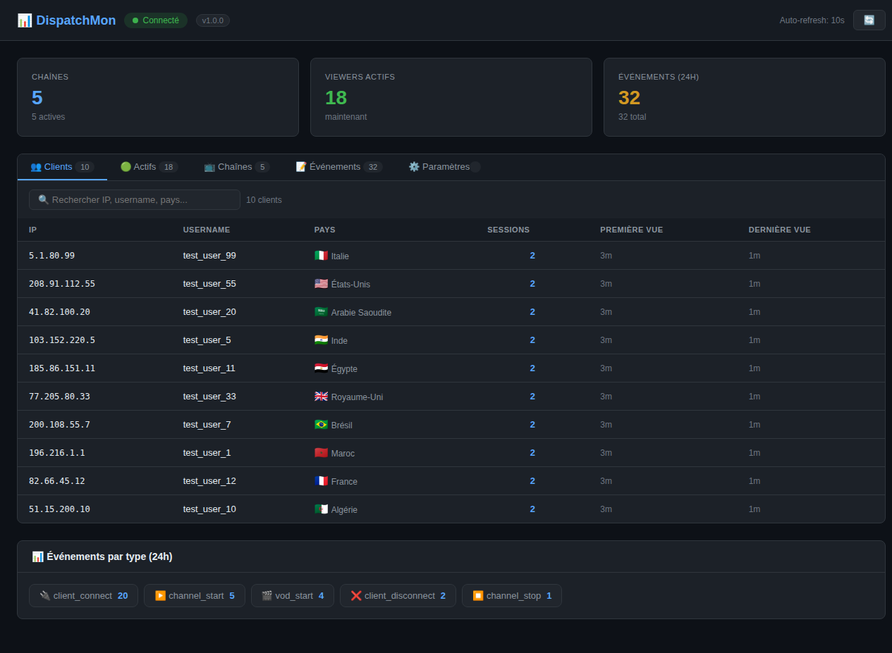
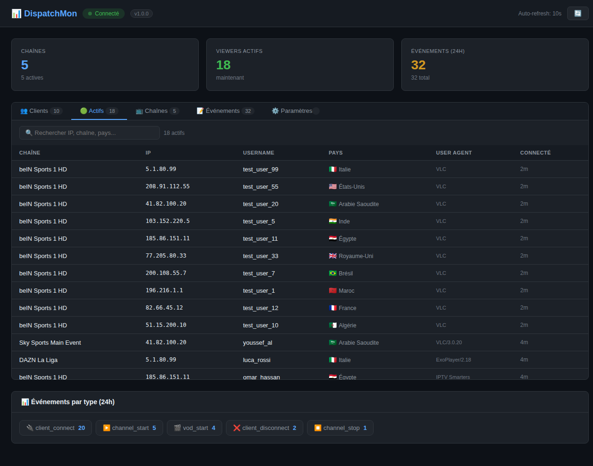
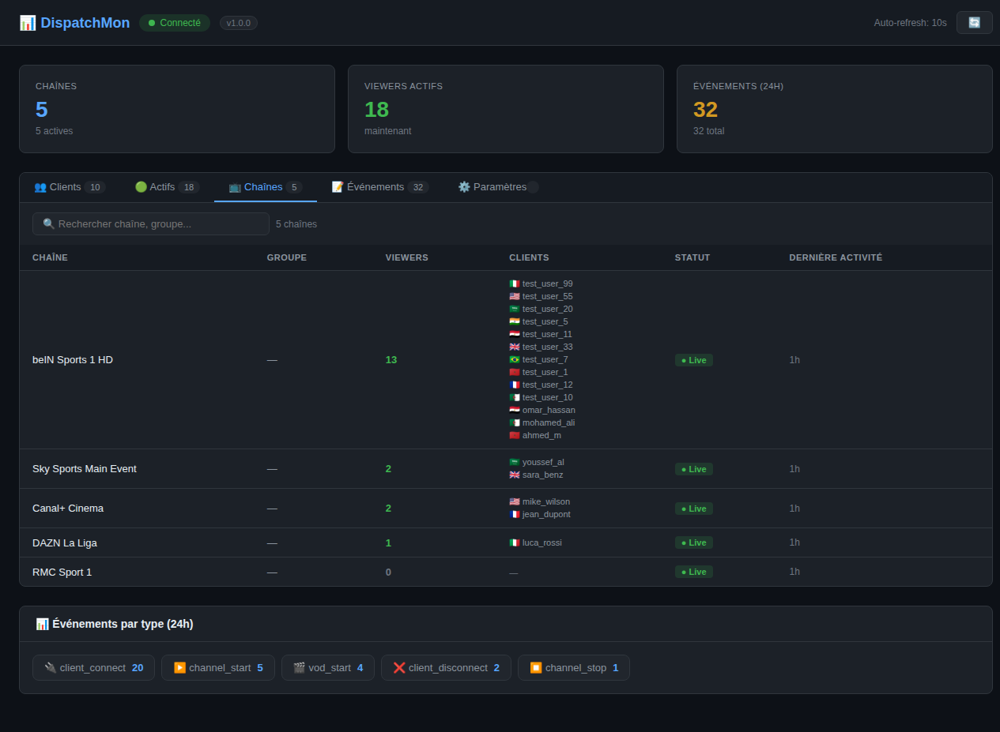
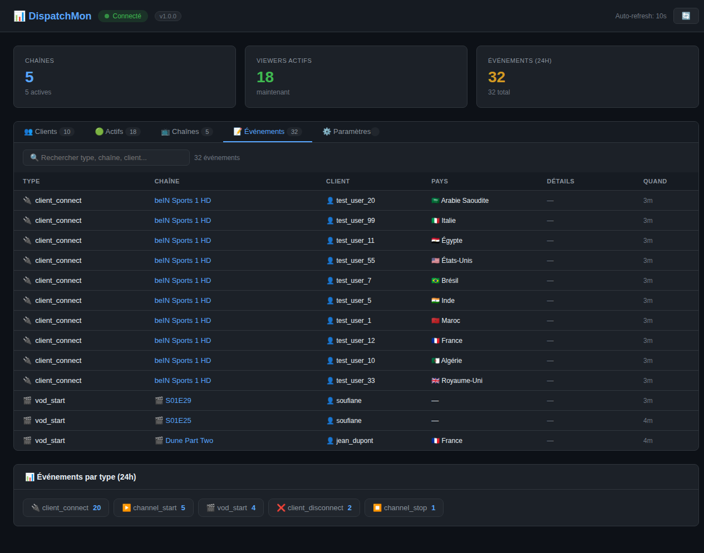
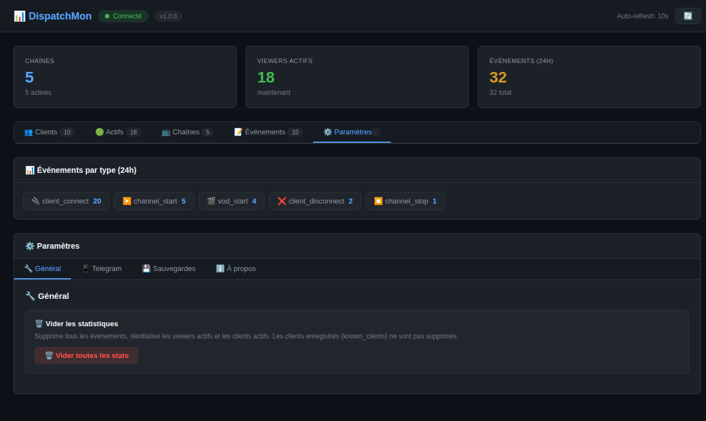

# 📊 DispatchMon

Dashboard web temps réel pour **Dispatcharr** — monitorer les chaînes, clients, événements et notifications Telegram.

[](https://github.com/mahadouch/DispatchMon/releases)
[](LICENSE)

---

## 📋 Table des matières

- [Fonctionnalités](#-fonctionnalités)
- [Screenshots](#-screenshots)
- [Installation](#-installation)
- [Configuration Dispatcharr](#-configuration-dispatcharr)
- [Notifications Telegram](#-notifications-telegram)
- [Sauvegardes](#-sauvegardes)
- [API Reference](#-api-reference)
- [Scripts](#-scripts)
- [Structure du projet](#-structure-du-projet)

---

## ✨ Fonctionnalités

| Module | Description |
|--------|-------------|
| **👥 Clients** | Liste des clients connus (IP, username, pays, sessions) avec recherche |
| **🟢 Actifs** | Clients en temps réel connectés aux chaînes |
| **📺 Chaînes** | État des chaînes (live/off), viewers, liste des clients par chaîne |
| **📝 Événements** | Historique détaillé avec filtres par type et plage de dates |
| **📱 Telegram** | Notifications push configurables (15 types d'événements) |
| **🔗 Webhooks** | Notifications Discord, Slack et webhooks personnalisés |
| **💾 Sauvegardes** | Backup/restore de la base de données + backup automatique quotidien |
| **🌐 Géolocalisation** | Détection automatique du pays avec carte géo interactive |
| **🚀 Mises à jour** | Notification automatique lors de nouvelles releases GitHub |
| **📊 Graphiques** | Viewers 24h, Top Chaînes, Top Clients, Connexions 7 jours |
| **🖥️ Monitoring** | CPU, disque, mémoire, versions PHP/Laravel |
| **🔒 Auth** | Système de login avec tokens + changement email/mot de passe |
| **📥 Export** | Export CSV/JSON des clients et événements |
| **🎨 Thème** | Mode sombre/clair avec toggle ☀️/🌙 |

### Dashboard

- **Stats globales** : chaînes, viewers actifs, événements 24h
- **4 graphiques** : Viewers 24h, Top Chaînes (7j), Top Clients, Connexions (7j)
- **Carte géo** interactive avec clustering par pays
- **Monitoring système** en temps réel (CPU, disque, mémoire)
- **Auto-refresh** toutes les 10 secondes
- **Notifications toast** quand des clients se connectent/déconnectent
- **Mode sombre/clair** avec préférence sauvegardée
- **Version dynamique** avec notification de mise à jour

---

## 📸 Screenshots

| Clients | Actifs | Chaînes |
|---------|--------|---------|
|  |  |  |

| Événements | Paramètres |
|------------|------------|
|  |  | 

---

## 🚀 Installation

### Installation rapide (recommandée)

```bash
curl -fsSL https://raw.githubusercontent.com/mahadouch/DispatchMon/master/install.sh | bash
```

Le script automatise :
- Installation de Docker + Docker Compose (si nécessaire)
- Clonage du repo
- Build des images Docker
- Démarrage des conteneurs
- Exécution des migrations
- Création du service systemd (démarrage auto au boot)
- Configuration Telegram (via .env)

### Mise à jour

```bash
cd ~/DispatchMon && git pull && sudo systemctl restart dispatchmon
```

### Commandes du service

```bash
sudo systemctl status dispatchmon      # Statut
sudo systemctl restart dispatchmon     # Redémarrer
sudo systemctl stop dispatchmon        # Arrêter
sudo journalctl -u dispatchmon -f      # Logs
```

### Installation manuelle

```bash
git clone https://github.com/mahadouch/DispatchMon.git
cd DispatchMon
docker compose up -d --build
```

### Services

| Service | URL | Description |
|---------|-----|-------------|
| **Frontend** | `http://localhost:3000` | Dashboard web |
| **Backend** | `http://localhost:8000` | API REST |

### Accès par défaut

| Champ | Valeur |
|-------|--------|
| **URL** | `http://<VOTRE_IP>:3000` |
| **Email** | `admin@dispatchmon.local` |
| **Mot de passe** | `password` |

> ⚠️ Changez le mot de passe dès la première connexion via **Paramètres → Général → Changer le mot de passe**

---

## ⚙️ Configuration Dispatcharr

Dans votre serveur Dispatcharr, configurez l'intégration webhook :

1. Allez dans **Settings** → **Integrations** → **Connect**
2. Créez une nouvelle intégration **Webhook**
3. Entrez l'URL : `http://<VOTRE_IP>:8000/api/webhook/dispatcharr`
4. Ajoutez les subscriptions pour chaque événement :
   - `channel_start` / `channel_stop`
   - `client_connect` / `client_disconnect`
   - `channel_error` / `channel_reconnect` / `channel_failover`
   - `stream_switch` / `m3u_refresh` / `epg_refresh`
   - `login_failed` / `recording_start` / `recording_end`
   - `vod_start` / `vod_stop`

---

## 📋 Templates Webhook Dispatcharr

Voici les templates payload exacts configurés dans l'intégration Connect de Dispatcharr. Chaque événement utilise la syntaxe Jinja2 avec `escapejs` et `default`.

### ▶️ channel_start

```json
{
  "event": "channel_start",
  "channel_name": "{{ channel_name|escapejs }}",
  "stream_name": "{{ stream_name|default:\"-\"|escapejs }}",
  "stream_url": "{{ stream_url|default:\"-\"|escapejs }}",
  "provider_name": "{{ provider_name|default:\"-\"|escapejs }}",
  "profile_used": "{{ profile_used|default:\"-\"|escapejs }}"
}
```

### ⏹️ channel_stop

```json
{
  "event": "channel_stop",
  "channel_name": "{{ channel_name|escapejs }}",
  "runtime": {{ runtime|default:"0" }},
  "total_bytes": {{ total_bytes|default:"0" }}
}
```

### 🔌 client_connect

```json
{
  "event": "client_connect",
  "channel_name": "{{ channel_name|escapejs }}",
  "client_ip": "{{ client_ip|default:\"-\"|escapejs }}",
  "client_id": "{{ client_id|default:\"-\"|escapejs }}",
  "user_agent": "{{ user_agent|default:\"-\"|escapejs }}",
  "username": "{{ username|default:\"-\"|escapejs }}"
}
```

### 🔴 client_disconnect

```json
{
  "event": "client_disconnect",
  "channel_name": "{{ channel_name|escapejs }}",
  "client_ip": "{{ client_ip|default:\"-\"|escapejs }}",
  "client_id": "{{ client_id|default:\"-\"|escapejs }}",
  "duration": {{ duration|default:"0" }},
  "bytes_sent": {{ bytes_sent|default:"0" }},
  "username": "{{ username|default:\"-\"|escapejs }}"
}
```

### ⚠️ channel_error

```json
{
  "event": "channel_error",
  "channel_name": "{{ channel_name|escapejs }}",
  "error_type": "{{ error_type|default:\"-\"|escapejs }}",
  "error_message": "{{ error_message|default:\"-\"|escapejs }}",
  "attempts": {{ attempts|default:"0" }}
}
```

### 🔄 channel_reconnect

```json
{
  "event": "channel_reconnect",
  "channel_name": "{{ channel_name|escapejs }}",
  "attempt": {{ attempt|default:"0" }},
  "max_attempts": {{ max_attempts|default:"0" }}
}
```

### ⚡ channel_failover

```json
{
  "event": "channel_failover",
  "channel_name": "{{ channel_name|escapejs }}",
  "reason": "{{ reason|default:\"-\"|escapejs }}",
  "duration": {{ duration|default:"0" }}
}
```

### 🔀 stream_switch

```json
{
  "event": "stream_switch",
  "channel_name": "{{ channel_name|escapejs }}",
  "new_url": "{{ new_url|default:\"-\"|escapejs }}",
  "stream_id": {{ stream_id|default:"0" }}
}
```

### 📡 m3u_refresh

```json
{
  "event": "m3u_refresh",
  "account_name": "{{ account_name|default:\"-\"|escapejs }}",
  "elapsed_time": {{ elapsed_time|default:"0" }},
  "streams_created": {{ streams_created|default:"0" }},
  "streams_updated": {{ streams_updated|default:"0" }},
  "streams_deleted": {{ streams_deleted|default:"0" }},
  "total_processed": {{ total_processed|default:"0" }}
}
```

### 📺 epg_refresh

```json
{
  "event": "epg_refresh",
  "source_name": "{{ source_name|default:\"-\"|escapejs }}",
  "programs": {{ programs|default:"0" }},
  "channels": {{ channels|default:"0" }},
  "skipped_programs": {{ skipped_programs|default:"0" }},
  "unmapped_channels": {{ unmapped_channels|default:"0" }}
}
```

### 🚫 login_failed

```json
{
  "event": "login_failed",
  "user": "{{ user|default:\"-\"|escapejs }}",
  "client_ip": "{{ client_ip|default:\"-\"|escapejs }}",
  "reason": "{{ reason|default:\"-\"|escapejs }}"
}
```

### ⏹️ recording_start / recording_end

```json
{
  "event": "recording_start",
  "channel_name": "{{ channel_name|escapejs }}",
  "recording_id": {{ recording_id|default:"0" }}
}
```

```json
{
  "event": "recording_end",
  "channel_name": "{{ channel_name|escapejs }}",
  "recording_id": {{ recording_id|default:"0" }},
  "interrupted": {{ interrupted|default:"false" }},
  "bytes_written": {{ bytes_written|default:"0" }}
}
```

### 🎬 vod_start / vod_stop

```json
{
  "event": "vod_start",
  "content_name": "{{ content_name|default:\"-\"|escapejs }}",
  "content_uuid": "{{ content_uuid|default:\"-\"|escapejs }}",
  "client_ip": "{{ client_ip|default:\"-\"|escapejs }}",
  "username": "{{ username|default:\"-\"|escapejs }}"
}
```

### 📌 Résumé des événements

| Événement | Champs principaux | Description |
|-----------|-------------------|-------------|
| `channel_start` | channel_name, stream_name, provider_name | Démarrage d'un stream |
| `channel_stop` | channel_name, runtime, total_bytes | Arrêt d'un stream |
| `client_connect` | channel_name, client_ip, client_id, username | Connexion client |
| `client_disconnect` | channel_name, client_ip, duration, bytes_sent | Déconnexion client |
| `channel_error` | channel_name, error_type, error_message | Erreur de stream |
| `channel_reconnect` | channel_name, attempt, max_attempts | Tentative de reconnexion |
| `channel_failover` | channel_name, reason, duration | Basculement source |
| `stream_switch` | channel_name, new_url, stream_id | Changement de source |
| `m3u_refresh` | account_name, streams_created/updated/deleted | Rafraîchissement M3U |
| `epg_refresh` | source_name, programs, channels | Rafraîchissement EPG |
| `login_failed` | user, client_ip, reason | Échec d'authentification |
| `recording_start` | channel_name, recording_id | Début d'enregistrement |
| `recording_end` | channel_name, recording_id, interrupted | Fin d'enregistrement |
| `vod_start` | content_name, content_uuid, username | Début VOD |
| `vod_stop` | content_name, content_uuid, username | Fin VOD |

> 💡 **Note :** Les variables `{{ variable|default:"-"|escapejs }}` sont remplacées par Dispatcharr avant l'envoi.

---

## 📱 Notifications Telegram

### Configuration

1. Créez un bot via **@BotFather** sur Telegram
2. Récupérez le **Bot Token**
3. Envoyez un message au bot puis récupérez le **Chat ID** via :
   ```
   https://api.telegram.org/bot<BOT_TOKEN>/getUpdates
   ```
4. Configurez dans le dashboard → ⚙️ Paramètres → 📱 Telegram

### Via fichier .env (recommandé)

```bash
# Créer le fichier .env
cat > ~/DispatchMon/.env << EOF
TELEGRAM_BOT_TOKEN=ton_token
TELEGRAM_CHAT_ID=ton_chat_id
TELEGRAM_ENABLED=1
EOF
```

### Événements notifiés

| Événement | Description | Exemple |
|-----------|-------------|---------|
| `client_connect` | Nouveau client connecté | 🟢 Nouveau client 👤 user 🇲🇦 Maroc |
| `client_disconnect` | Client déconnecté | 🔴 Déconnexion |
| `channel_start` | Chaîne démarrée | ▶️ Chaîne démarrée 📺 beIN Sports 1 |
| `channel_stop` | Chaîne arrêtée | ⏹️ Chaîne arrêtée ⏱️ 7200s |
| `channel_error` | Erreur de stream | ⚠️ Erreur 📺 channel |
| `channel_reconnect` | Tentative reconnexion | 🔄 Reconnexion tentative 2/5 |
| `channel_failover` | Basculement source | ⚡ Failover |
| `stream_switch` | Changement de source | 🔀 Changement source |
| `m3u_refresh` | Rafraîchissement M3U | 📡 +12 créés, -2 supprimés |
| `epg_refresh` | Rafraîchissement EPG | 📺 850 programmes |
| `login_failed` | Connexion refusée | 🚫 Connexion refusée |
| `recording_start` | Début enregistrement | ⏺️ Enregistrement démarré |
| `recording_end` | Fin enregistrement | ⏹️ Enregistrement terminé |
| `vod_start` | Début VOD | 🎬 VOD démarré |
| `vod_stop` | Fin VOD | ⏹️ VOD terminé |

### Exemple de notification

```
▶️ Chaîne démarrée
📺 beIN Sports 1 HD
🏷️ Stream: beinsports1-hd
📡 Provider: Yassine
⚙️ Profil: VLC
🔗 http://source.example.com/live/stream1
🕐 26/06/2026 10:43
```

---

## 💾 Sauvegardes

### Via le dashboard

1. Allez dans ⚙️ Paramètres → 💾 Sauvegardes
2. Cliquez sur **💾 Créer un backup**
3. Le backup est sauvegardé dans `storage/app/backups/`

### Actions disponibles

- **🔄 Restaurer** : Écrase la base actuelle avec le backup
- **📥 Télécharger** : Télécharge le fichier `.sqlite`
- **🗑️ Supprimer** : Supprime un backup

### Via API

```bash
# Créer un backup
curl -X POST http://localhost:8000/api/backups

# Lister les backups
curl http://localhost:8000/api/backups

# Restaurer
curl -X POST http://localhost:8000/api/backups/backup_2026-01-01_12-00-00/restore

# Télécharger
curl -O http://localhost:8000/api/backups/backup_2026-01-01_12-00-00/download

# Supprimer
curl -X DELETE http://localhost:8000/api/backups/backup_2026-01-01_12-00-00
```

---

## 📡 API Reference

### Webhook

```
POST /api/webhook/dispatcharr
```

Reçoit les événements de Dispatcharr (pas d'authentification).

### Stats

| Méthode | Endpoint | Description |
|---------|----------|-------------|
| `GET` | `/api/stats/summary` | Résumé global |
| `GET` | `/api/stats/channels` | Chaînes avec clients actifs |
| `GET` | `/api/stats/events` | 200 derniers événements |
| `GET` | `/api/stats/events/by-type` | Compteur par type (24h) |
| `GET` | `/api/stats/clients` | Clients actifs |
| `GET` | `/api/stats/timeline` | Événements par heure |
| `GET` | `/api/stats/m3u` | Stats M3U |
| `DELETE` | `/api/stats/events` | Purger > 30 jours |

### Clients

| Méthode | Endpoint | Description |
|---------|----------|-------------|
| `GET` | `/api/clients` | Tous les clients connus |
| `GET` | `/api/clients/active` | Clients connectés |
| `GET` | `/api/clients/stats` | Statistiques |

### Settings

| Méthode | Endpoint | Description |
|---------|----------|-------------|
| `GET` | `/api/settings` | Récupérer les settings |
| `PUT` | `/api/settings` | Mettre à jour |
| `POST` | `/api/settings/telegram/test` | Tester Telegram |

### Backups

| Méthode | Endpoint | Description |
|---------|----------|-------------|
| `GET` | `/api/backups` | Lister |
| `POST` | `/api/backups` | Créer |
| `POST` | `/api/backups/{name}/restore` | Restaurer |
| `GET` | `/api/backups/{name}/download` | Télécharger |
| `DELETE` | `/api/backups/{name}` | Supprimer |

### Version

| Méthode | Endpoint | Description |
|---------|----------|-------------|
| `GET` | `/api/version` | Version actuelle |
| `GET` | `/api/version/check` | Vérifier les mises à jour |

---

## 🛠️ Technologies

| Composant | Technologie | Version |
|-----------|-------------|---------|
| **Backend** | Laravel (PHP) | 11.x |
| **Frontend** | React + Vite | 19.x / 6.x |
| **Base de données** | SQLite | — |
| **Conteneurs** | Docker | — |
| **Notifications** | Telegram Bot API | — |
| **Géolocalisation** | ip-api.com | — |
| **Gestion versions** | GitHub Releases | — |

---

## 📁 Structure du projet

```
DispatchMon/
├── docker-compose.yml          # Orchestration Docker
├── Dockerfile.backend          # Image backend Laravel
├── Dockerfile.frontend         # Image frontend React
├── VERSION                     # Numéro de version
├── install.sh                  # Script d'installation
├── .env.example                # Template de configuration
│
├── backend/
│   ├── app/
│   │   ├── Http/Controllers/
│   │   │   ├── WebhookController.php    # Webhooks Dispatcharr
│   │   │   ├── StatsController.php      # API statistiques
│   │   │   ├── ClientController.php     # Gestion clients
│   │   │   ├── SettingsController.php   # Paramètres
│   │   │   ├── BackupController.php     # Sauvegardes
│   │   │   └── VersionController.php    # Version + updates
│   │   ├── Models/
│   │   │   ├── DispatcharrEvent.php
│   │   │   ├── Channel.php
│   │   │   ├── ActiveClient.php
│   │   │   ├── KnownClient.php
│   │   │   └── Setting.php
│   │   └── Services/
│   │       └── TelegramService.php
│   ├── bootstrap/app.php
│   ├── database/migrations/
│   └── routes/api.php
│
├── frontend/
│   ├── src/
│   │   ├── App.jsx             # Dashboard complet
│   │   ├── index.css           # Dark theme
│   │   └── main.jsx
│   └── vite.config.js
│
└── screenshots/                # Captures d'écran
```

---

## 📝 License

MIT

---

## 👤 Auteur

**mahadouch** — [GitHub](https://github.com/mahadouch)
